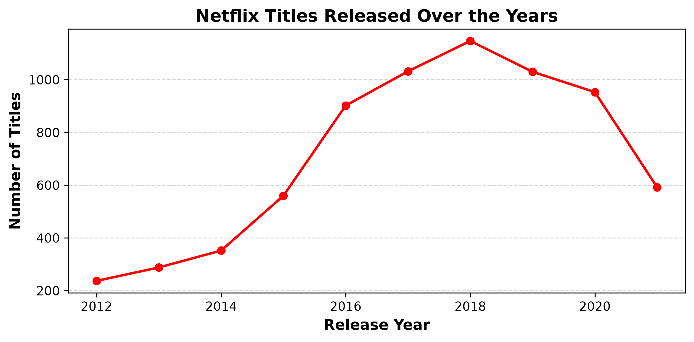
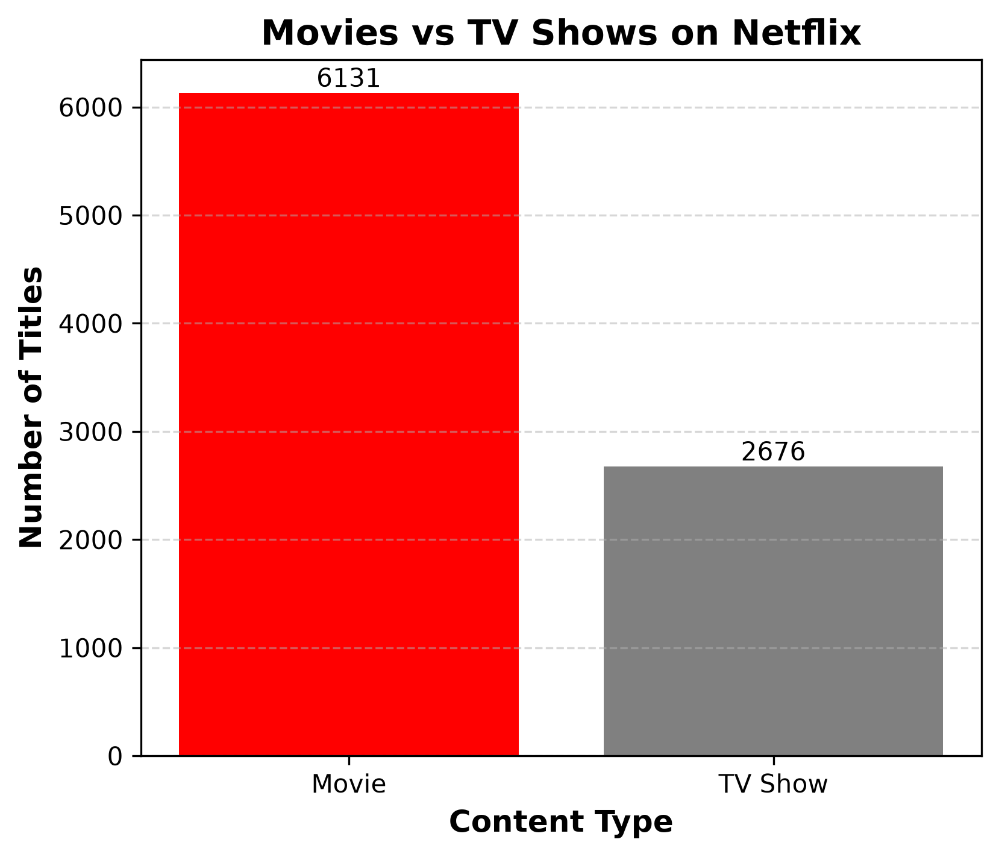
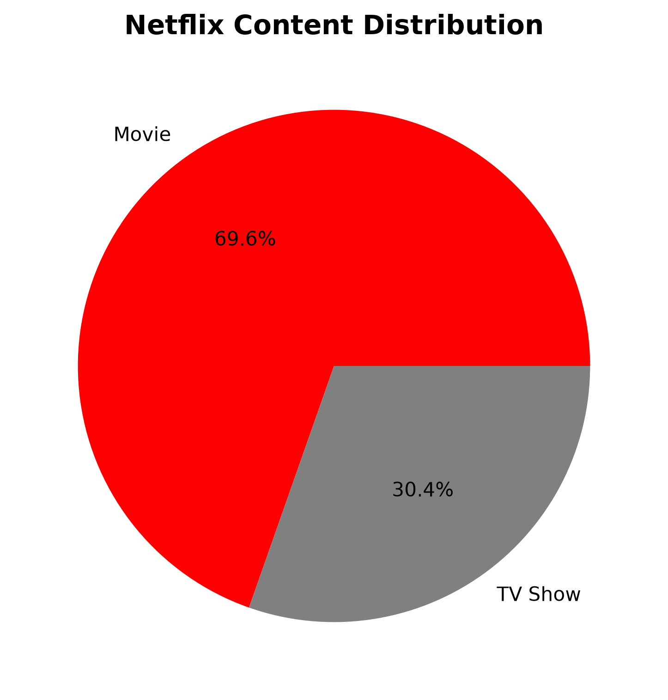

# 🎬 Netflix Data Analysis using Python

A professional **Exploratory Data Analysis (EDA)** project analyzing the Netflix Movies & TV Shows dataset using **Python, Pandas, NumPy, and Matplotlib**.

This project demonstrates the complete data analysis workflow—from data cleaning and preprocessing to exploratory analysis, statistical summaries, and visualization.

---

## 📌 Project Overview

This project explores more than **8,800 Netflix titles** to answer key business and analytical questions, including:

- 🌍 Which countries produce the most Netflix content?
- 🎬 Movies vs TV Shows distribution
- 🎭 Most common content ratings
- 🎥 Directors with the highest number of titles
- ⭐ Actors appearing most frequently
- 📅 Release year trends over time
- 🎯 Most popular genres
- 📈 Statistical summaries using NumPy

---

## 📂 Dataset

**Source:** https://www.kaggle.com/datasets/shivamb/netflix-shows

### Dataset Features

| Column |
|---------|
| Show ID |
| Title |
| Type (Movie / TV Show) |
| Director |
| Cast |
| Country |
| Date Added |
| Release Year |
| Rating |
| Duration |
| Genre |
| Description |

---

## 🛠 Technologies Used

- Python
- Pandas
- NumPy
- Matplotlib
- Jupyter Notebook

---

## 📚 Skills Demonstrated

### ✅ Data Cleaning
- Missing value detection
- Handling null values
- Duplicate checking
- Data type conversion
- Feature engineering

### ✅ Exploratory Data Analysis (EDA)
- Filtering & Sorting
- value_counts()
- groupby()
- agg()
- pivot_table()

### ✅ String Operations
- str.contains()
- str.startswith()
- str.endswith()
- str.len()

### ✅ Date & Time Analysis
- to_datetime()
- Year extraction
- Month extraction
- Weekday analysis
- Date filtering

### ✅ NumPy Analysis
- Mean
- Median
- Standard Deviation
- Percentiles
- np.where()
- np.unique()

### ✅ Data Visualization
- Bar Charts
- Line Charts
- Pie Charts
- Histograms
- Grid Styling
- Figure Customization
- Figure Saving

---

## 📁 Project Structure

```text
Netflix-data-analysis/
│
├── Netflix data analysis.ipynb
├── netflix_titles.csv
├── requirements.txt
├── README.md
│
└── graphs/
    ├── Releaseyears.png
    ├── movies&TV.png
    ├── content.png
    ├── actors.png
    ├── directors.png
    └── distributions.png
```

---

## 📊 Data Visualizations

### Netflix Titles Released Over the Years




### Movies vs TV Shows




### Content Distribution



---

## 🔍 Key Insights

- 📌 Movies significantly outnumber TV Shows.
- 🌍 The United States has the largest Netflix catalog.
- 🇮🇳 India is the second-largest contributor.
- 🎭 TV-MA is the most common content rating.
- 📅 2018 recorded the highest number of releases.
- 🎥 Rajiv Chilaka directed the most titles in the dataset.
- 📈 Netflix experienced rapid content growth between **2016–2020**.

---

## ▶️ How to Run

### Clone the repository

```bash
git clone https://github.com/Adeenaeman/Netflix-data-analysis-.git
```

### Install dependencies

```bash
pip install -r requirements.txt
```

### Open the notebook

```text
Netflix data analysis.ipynb
```

Run all cells to reproduce the complete analysis.

---

## 📌 Future Improvements

- Interactive dashboards using Plotly
- Power BI dashboard
- SQL-based analysis
- Predictive analytics using Machine Learning

---

## 👩‍💻 Author

**Adeena Eman**


**GitHub**  
https://github.com/Adeenaeman

**LinkedIn**  
https://www.linkedin.com/in/adeena-eman/

---

## ⭐ Support

If you found this project helpful, consider giving it a ⭐ on GitHub.
